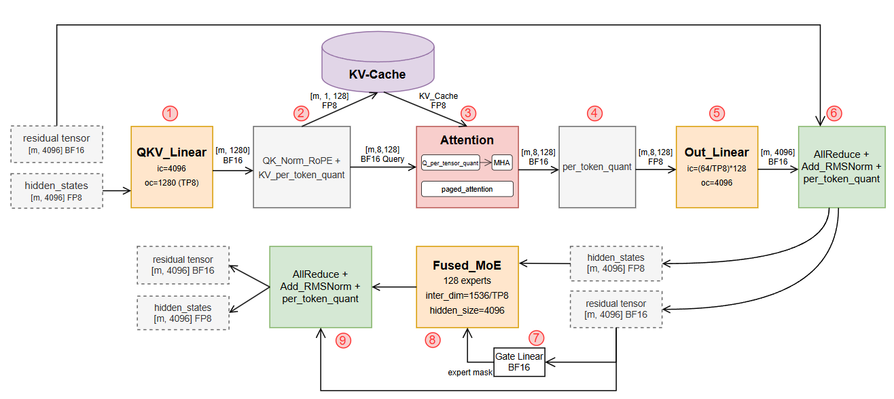
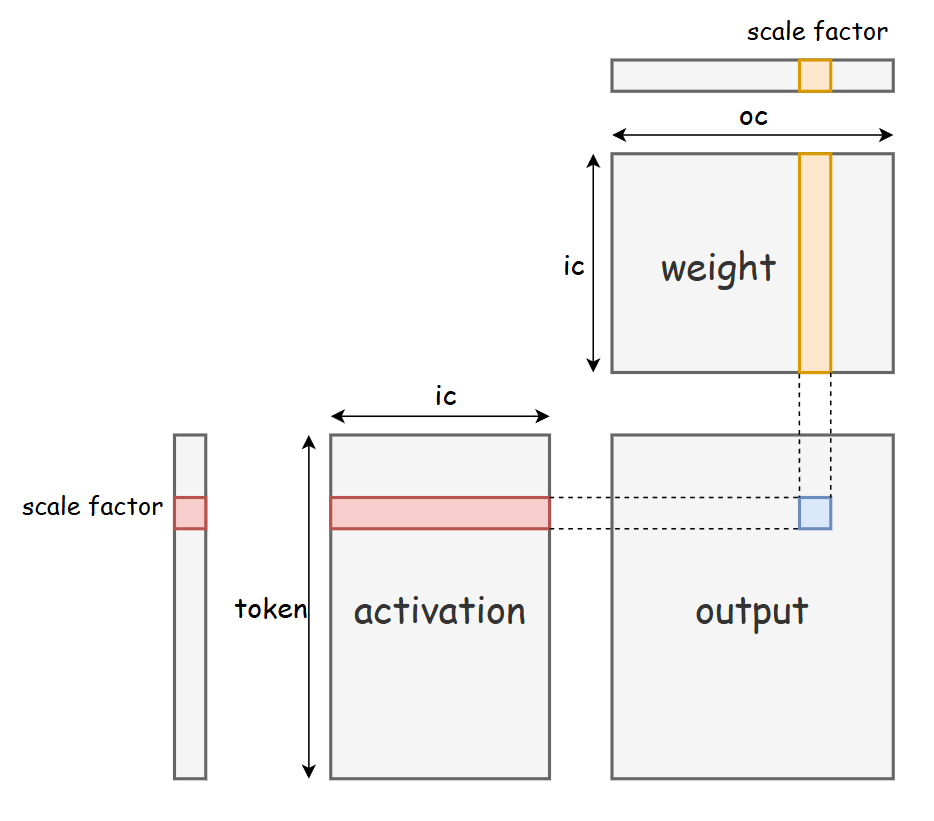
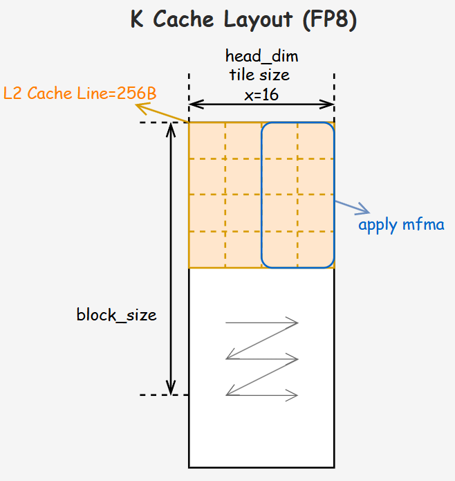
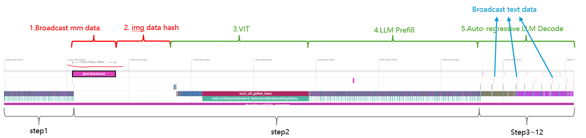
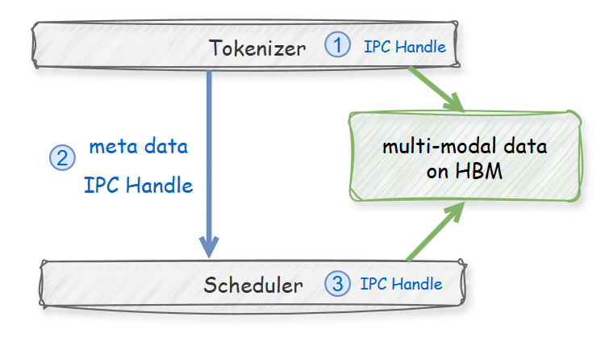
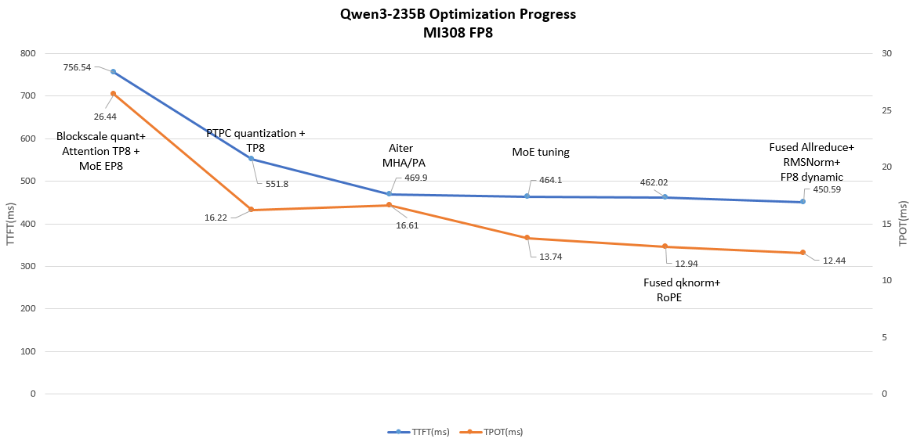
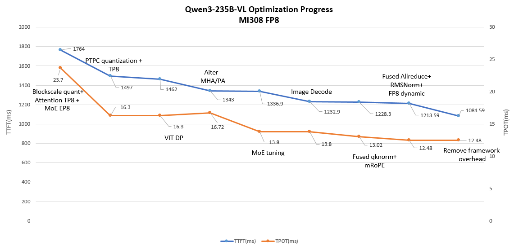

## 1. Introduction

Qwen is a series of large-scale, high-performance Large Language Models (LLMs) developed by the Qwen Team of Alibaba Cloud. From the first generation to the latest third-generation flagship models, all Qwen variants have undergone dedicated training and fine-grained tuning, endowing them with strong instruction-following capabilities, efficient deployability for interactive AI applications, and robust performance in solving complex tasks. As flagship models in the Qwen3 family, Qwen3-235B and Qwen3-VL-235B have achieved comprehensive multi-dimensional improvements and have been widely deployed at scale in the Qwen APP.

In recent months, the Qwen C-end Infrastructure Engineering Team and the AMD AI Framework Team have collaborated to implement extreme latency optimization solutions for Qwen3-235B and Qwen3-VL-235B on the AMD MI300 series GPU platform based on the SGLang framework. Remarkable breakthroughs have been achieved in terms of performance, precision, and stability.

- For Qwen3-235B: Compared with the baseline, the Time to First Token (TTFT) has been improved by 1.67×, and the Time Per Output Token (TPOT) has been improved by 2.12×.

- For Qwen3-VL-235B: Compared with the baseline, the Time to First Token (TTFT) has been improved by 1.62×, and the Time Per Output Token (TPOT) has been improved by 1.90×.

The AMD MI300 series GPUs are built on the CDNA 3 architecture, featuring 192 GB of HBM3 memory per card—sufficient to support inference for models with over 70 billion parameters. Combined with a 5.3 TB/s memory bandwidth, 256 MB Infinity Cache, and native Matrix Core support for FP8 and PTPC quantization, the platform delivers exceptional performance and cost-efficiency, making it an ideal choice for large-scale LLM cluster deployment.

This paper elaborates on the performance optimization techniques jointly explored and implemented by the two teams, with a core focus on achieving ultra-low-latency inference. All optimization work has been opened-source in: [[Tracking][Performance][AMD] Qwen3 & Qwen3-VL Latency Optimization on AMD MI300 Series GPUs](https://github.com/sgl-project/sglang/issues/18466).

  

<em>Figure 1. Qwen3-VL model structure (from Qwen3-VL paper)</em>

## 2. Latency Optimization Techniques

### 2.1 Latency Optimization for Qwen3-235B

The inference computation flow of Qwen3-235B is illustrated in Figure 2. The following sections will elaborate the optimizations on these critical components.

  

<em>Figure 2. Qwen3-235B model inference computation flowchart</em>

#### 2.1.1 GEMM Quantization Strategy

  

<em>Figure 3. PTPC-FP8: Per-Token-Activation, Per-Channel-Weight Quantization</em>

Quantization is critical to accelerating LLM inference. This work adopts the **PTPC** (Per Token Activation, Per Channel Weight) quantization scheme—an FP8 quantization method jointly applied to model weights and activations, whose core principles are illustrated in Figure 3. This scheme employs per-token quantization for activations and per-channel quantization for weights, achieving higher quantization accuracy and reducing information loss compared to conventional per-tensor FP8 quantization.

Compared to standard BlockScale FP8 quantization, PTPC quantization maintains comparable accuracy while delivering superior computational efficiency. The fixed block size of BlockScale often misaligns with the optimal tile size of hardware GEMM units, introducing additional overhead from data splitting and reordering. In contrast, PTPC’s fine-grained design eliminates fixed block constraints and naturally aligns with the native compute granularity of hardware GEMM units. Its per-channel weight quantization also better matches the channel-parallel compute architecture of modern accelerators. Combined with the throughput gains from low-precision computation, PTPC-based GEMM significantly enhances hardware utilization.

Experimental results on the AMD ROCm platform demonstrate that PTPC FP8 GEMM quantization outperforms BlockScale FP8 by 15%–30%, with more significant latency reductions in small-matrix and misaligned-matrix deployment scenarios.

#### 2.1.2 Parallelization Strategy

During experiments on implementing Expert Parallelism (EP) for Qwen3-235B, we observed expert hotspots on certain datasets (as shown in Figure 4; for example, layer 57, EP ranks 10/120/216 are frequently accessed hot experts). This load imbalance creates latency bottlenecks during inference.

  

<em>Figure 4. Expert Hotspot Distribution</em>

In Qwen’s production scenarios, TTFT and TPOT are critical performance metrics. Measurements confirm that MoE model inference is typically memory-bound. The high-bandwidth HBM of the AMD MI300 series effectively alleviates I/O bottlenecks in Tensor Parallelism (TP), thereby drastically reducing inference latency.

For the full Qwen3-235B model (including its MoE structure), we deploy a TP8 tensor parallelism configuration combined with PTPC FP8 quantization to achieve extreme low latency. Specifically, PTPC’s per-channel weight quantization—equipped with 192 independent scaling factors—enables seamless compatibility between MoE modules and TP8, ensuring stable and efficient large-scale parallel deployment.

In low-concurrency, extreme-latency-critical scenarios, TP8 distributes model weights across 8 GPUs, reducing per-card weight loading and memory latency. Architecturally, it also mitigates MoE expert load imbalance, further solidifying the foundation for ultra-low-latency inference.

#### 2.1.3 Attention Module Optimization

**(1) Optimized KV-Cache layout**

For the Attention module, we integrate highperformance MHA and PagedAttention operators from AMD’s AITER Library, which are customized for a specialized KV Cache layout. The layout is defined as:

- k_cache: [num_blocks, num_kv_heads, head_dim // x, block_size, x]
- v_cache: [num_blocks, num_kv_heads, block_size // X, head_dim, X]

This layout aligns memory access patterns with the AMD CDNA 3 architecture, drastically improving the memory efficiency of PagedAttention. During the decode phase, no additional device-to-device (D2D) copies are required for layout conversion, thus eliminating redundant overhead (Figure 5). Compared to the standard KV Cache layout [num_blocks, num_kv_heads, head_dim, block_size], this optimization improves decode throughput by 15%–20% while reducing inference latency.

  

<em>Figure 5. K Cache Layout Distribution</em>

**(2) DataType Optimization**

- In the **prefill** phase: per-tensor FP8 quantization is applied to query, key, and value activations for MHA.

- In the **decode** phase: query uses BF16, while KV Cache remains stored in per-tensor FP8 (consistent with prefill).

This mixed precision configuration reduces HBM usage while maintaining accuracy and performance.

#### 2.1.4 MoE Optimization

For low-concurrency workloads, we have deeply optimized MoE operators in AITER across four key dimensions:

- **Load Balancing**: Fine-grained task scheduling for Compute Units (CUs) during low-concurrency inference enables near-synchronized execution, eliminating idle cycles and maximizing hardware utilization.

- **Compute Efficiency**: Hardware-aware loop tuning on the K dimension eliminates redundant operations and significantly improves throughput.

- **Memory Efficiency**: Optimized atomic memory access patterns enhance L2 cache hit rates and alleviate memory bandwidth bottlenecks.

- **Auto-tuning**: Following manual optimizations, automated tuning tools search for optimal operator configurations to further maximize performance.

Notably, load balancing and fine-grained scheduling yield particularly strong performance gains during LLM decoding, ultimately **improving MoE module performance by 2×**.

#### 2.1.5 Kernel Fusion Optimization

We also fused several critical operators, including:

- Module 2: QKNorm + RoPE

- Modules 6 & 9: AllReduce + AddRMSNorm + per-token quant

Operator fusion reduces frequent HBM access and further lowers endtoend inference latency.

| Fusion pattern | Before (us) | After (us) | Speedup Ratio |
| --- | --- | --- | --- | --- |
| QKNorm + RoPE | 11.6 | 5.1 | 127% |
| AllReduce + AddRMSNorm + Quant | 35 | 21 | 67% |

### 2.2 Optimization for Qwen3-VL-235B

  

<em>Figure 6. Qwen3-VL-235B deployment in SGLang</em>

Compared to Qwen3‑235B, Qwen3‑VL‑235B introduces several new critical inference stages:

- Multimodal data format adaptation, preprocessing, and cross‑modal alignment

- ViT encoder execution, visual patch embedding, and cross‑modal feature fusion

These extensions lengthen the inference pipeline and involve complex cross‑modal data coordination and feature adaptation, significantly increasing per‑request latency. The full dataflow is shown in Figure 6. Relative to pure language LLMs, Qwen3‑VL’s major overhead comes from three sources:

- Host‑side multimodal preprocessing

- Multimodal data transfer

- GPU‑side ViT encoder computation

We designed targeted latency optimizations for each bottleneck.

#### 2.2.1 Image Decoding Optimization with rocJPEG

In the traditional pipeline, host‑side JPEG decoding and tensor conversion is slow: a single 720p image takes ~27 ms. Latency grows rapidly with multiple images or video frames, severely limiting the inference efficiency.

To accelerate decoding and reduce end‑to‑end latency, we integrated rocJPEG—AMD’s high‑performance GPU‑accelerated JPEG decoding SDK —as a backend for torchvision. When JPEG inputs are received, the SGLang Tokenizer image decoder invokes torchvision APIs to offload decoding to the GPU via rocJPEG (Figure 7). Measurements show decoding latency for a single 720p image drops to ~4 ms, representing a **~7× speedup**.

  

<em>Figure 7. rocJPEG Decoding Flowchart</em>

#### 2.2.2 Multimodal Data Transfer Optimization

In SGLang, the Tokenizer and Scheduler typically run in separate processes. Preprocessed multimodal data must be transferred via IPC to the Scheduler. Traditional CPU based gloo:broadcast is inefficient for large multimodal data (Figure 8).

  

<em>Figure 8. Host overhead of multimodality transmission and image hash encoding</em>

The ROCm backend supports **CUDA IPC**, enabling direct GPU to GPU data transfer without CPU intermediation. This eliminates redundant CPU GPU copies and drastically reduces multimodal transfer latency, as shown in Figure 9. Additionally, we offload image hashing (Figure 6) to the GPU, further compressing overhead.

  

<em>Figure 9. CUDA IPC on ROCm backend
</em>

#### 2.2.3 Data parallelism for VIT

The Vision Transformer (ViT) module performs visual feature encoding from images and videos. For high-resolution inputs, however, it becomes a severe compute-bound bottleneck due to patch-based tokenization:

- Inputs are split into fixed patches (e.g., 16×16)

- Sequence length grows quadratically with resolution

- Full selfattention has complexity O(N2)

A 1280×1280 image generates approximately 4,800 tokens (consistent with original correction: 960×1280 → 4,800 tokens), resulting in over 23 million attention interactions. In extreme scenarios involving large batches of high-resolution images or long videos, token counts can surpass 1M, pushing attention complexity to O(1012). This leads to explosive memory consumption, extreme latency, and low hardware utilization.

To alleviate these issues, we apply Data Parallelism (DP) to the ViT module: multi-image inputs are split and processed in parallel across independent GPUs (Figure 6). This strategy distributes the computational load and reduces per-GPU pressure. In experiments with 5 images per request (960×1280), we observed 3%–4% performance improvements. The performance gain scales with the number of input images and videos.

## 3. Experimental and Benchmarks

### 3.1 Experimental setup

#### 3.1.1 Hardware

We deploy our system with the SGLang inference engine on a single AMD MI308 node with 8 GPU cards. The optimization techniques presented are **general, portable, and readily applicable** to other AMD platforms built upon the **CDNA 3 architecture**.

#### 3.1.2 Model Weights

We use PTPC-FP8 quantization recipe and the corresponding model weights are available at [Qwen3‑235B](https://huggingface.co/RedHatAI/Qwen3-235B-A22B-FP8-dynamic) and [Qwen3-VL-235B](https://huggingface.co/RedHatAI/Qwen3-VL-235B-A22B-Instruct-FP8-dynamic).

#### 3.1.3 Test Scenarios

These optimizations target **low latency inference scenarios**, with evaluation settings as follows:

- **Qwen3‑235B:** Single request, Input Sequence Length (ISL) = 8000, Output Sequence Length (OSL) = 500.

- **Qwen3‑VL‑235B:** Single request, text ISL = 8000, 5 images (960×1280) per request, OSL = 500.

### 3.2 CUDA IPC Configuration 

To enable **GPU direct IPC** for efficient multimodal data transfer, users can set the following environment variables. The variable value can be changed according to different scenarios.

- export SGLANG_USE_CUDA_IPC_TRANSPORT=1

- export SGLANG_VLM_CACHE_SIZE_MB=8192

Experimental results show that, for 5 images of 960×1280 resolution, enabling CUDA IPC yields a **significant reduction in data transfer latency**, with a peak reduction of up to 2 seconds compared with gloo:broadcast.

### 3.3 Performance Review

For Qwen235B, the performance optimization milestones are shown in Figure 10. The (Time to First Token) TTFT has improved by 1.67x, reducing from 756.54ms to 450.59ms. The (Time per Output Token) TPOT has improved by 2.12x, reducing from 26.44ms to 12.44ms.

  

<em>Figure 10. Qwen3-235B TTFT and TPOT optimization milestones
</em>

For Qwen3-VL-235B, the performance optimization results are shown in Figure 11. The (Time to First Token) TTFT has improved by 1.62x, reducing from 1764ms to 1084.59ms. The (Time per Output Token) TPOT has improved by 1.90x, reducing from 23.7ms to 12.48ms.

  

<em>Figure 11. Qwen3-VL-235B TTFT and TPOT optimization milestones
</em>

## 4. Reference
- [Qwen3：Thinker Deeper, Act Faster](https://qwen.ai/blog?id=qwen3)
- [AITER](https://github.com/ROCm/aiter)
- [SGLang Document](https://docs.sglang.io/)
- [rocJPEG](https://github.com/ROCm/rocJPEG)
